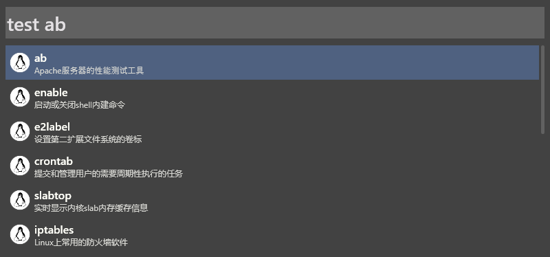

# wox plugin for linux command

thx for these windful projects:

- [linux command](http://wangchujiang.com/linux-command): easy to get help for the linux command
- [wox](http://www.wox.one/): awesome tool for win

learn how to write code from these projects:

- [linux command for alfred](https://github.com/jaywcjlove/linux-command/releases)
- [wox plugin for duokan book](https://github.com/renmu123/wox-book)

## todo

- can not use activekeywork `lc`, now use `test`
- use file in local instead of quqery github api for everytime